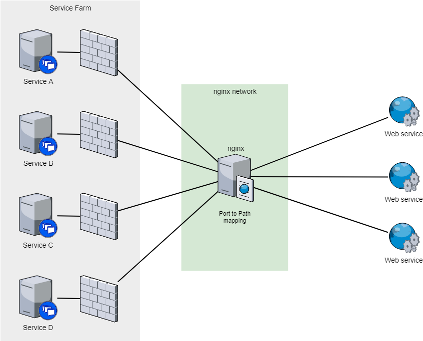

# dockit

Handles docker service deployment and certification for an Nginx app.

### Description


Exposes docker services using nginx, auto provisioning the SSL via Let's Encrypt.

### Dependencies

* python3
* docker
* docker-compose

### Configuration
Append your service to *services.yaml* as
```yaml
# ----
  - name:         # unique service name
    port:         # service port
    host:         # hostname  (to use for SSL)
    email:        # email     (to use for SSL)
    production:   # set to false if running tests
    path:         # service path, defaults to /
    domains:      # domain list to autoprovision
      - secondary-example.com
      - www.secondary-example.com
      - www.sub.secondary-example.com
```
Note: Your service must be running inside the same network as the nginx, with exposed SERVICE_PORT to the network.

### Execution

```bash
# nano *service.yaml*
./main.py
```
